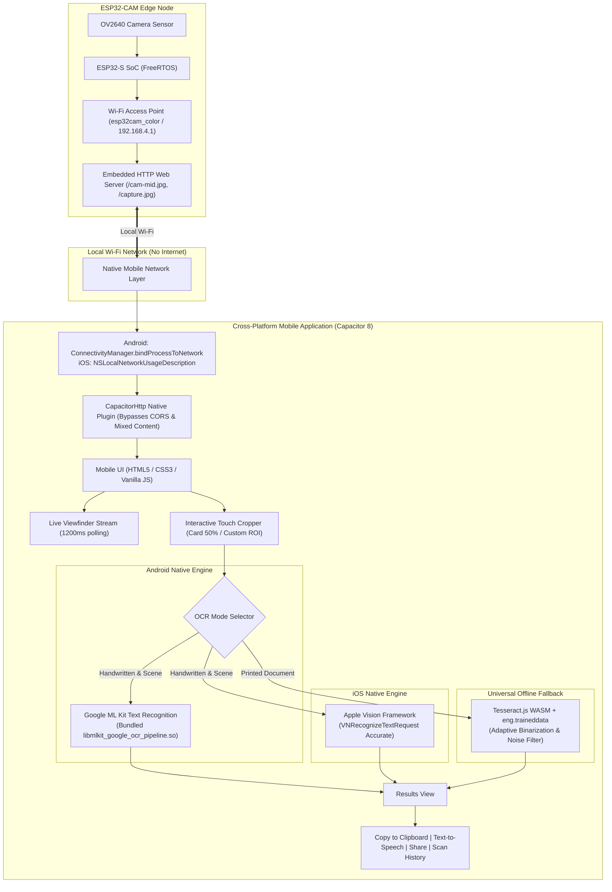

# 📷 ESP32-CAM Text & Handwriting Reader (Android & iOS)

[](https://developer.android.com/)
[](https://developer.apple.com/ios/)
[](https://capacitorjs.com/)
[](https://developers.google.com/ml-kit)
[](https://developer.apple.com/documentation/vision)
[](https://tesseract.projectnaptha.com/)
[](https://www.espressif.com/)

A complete, production-grade cross-platform mobile solution that pairs an **AI-Thinker ESP32-CAM** with an **Android APK** and **iOS Application**. The system captures photos of handwritten alphanumeric text (badges, notes, index cards) and printed documents over local Wi-Fi, running **100% on-device neural OCR offline without requiring an internet connection or external cloud servers**.

---

## 📑 Table of Contents

- [Problem Statement](#-problem-statement)
- [System Architecture](#-system-architecture)
- [Key Features](#-key-features)
- [Challenges Faced & Engineering Solutions](#-challenges-faced--engineering-solutions)
- [Technology Stack](#-technology-stack)
- [Repository Structure](#-repository-structure)
- [Hardware Setup & ESP32 Firmware](#-hardware-setup--esp32-firmware)
- [Building & Installing the Apps](#-building--installing-the-apps)
  - [Android APK Installation & Build](#1-android-apk)
  - [iOS Application Build (No Mac Required)](#2-ios-application)
- [License](#-license)

---

## 🎯 Problem Statement

In industrial, academic, and field environments, microcontrollers like the ESP32-CAM capture real-time camera imagery. However, processing optical character recognition (OCR) on an edge microcontroller is nearly impossible due to RAM (typically 4MB PSRAM) and CPU constraints.

Traditional approaches rely on:
1. **Laptops running Python scripts**: Requiring users to carry a computer running OpenCV and Tesseract alongside the camera.
2. **Cloud APIs (Google Cloud Vision, AWS Rekognition)**: Requiring active internet access, which fails when the mobile device is directly tethered to the ESP32's local Wi-Fi Access Point (an intranet without internet gateway).

### The Goal
Create a standalone, cross-platform mobile app (**Android APK + iOS App**) where:
* The phone directly connects to the ESP32-CAM Wi-Fi (`esp32cam_color` @ `192.168.4.1`).
* The user views a live stream, captures high-resolution snapshots, and crops regions of interest.
* **Handwritten alphanumeric characters** (e.g., pen ink on badges, labels, forms) and printed documents are recognized instantly and accurately.
* Everything runs **100% offline** on the smartphone with zero internet connection.

---

## 🏗 System Architecture



---

## ✨ Key Features

- **Dual-Platform Ready**: Fully implemented and configured for both **Android** (`.apk`) and **iOS** (`.xcodeproj` / `.ipa`).
- **Google ML Kit Neural Vision (Android)**: Native on-device neural network that first detects text bounding boxes and ignores background clutter like wires, desks, clips, and shadows.
- **Apple Vision Framework (iOS)**: Native `VNRecognizeTextRequest` utilizing Apple's machine learning engine for offline Latin handwriting recognition with zero third-party dependencies.
- **Interactive Region of Interest (ROI) Cropper**:
  - Touch-draggable and resizable crop handles.
  - One-tap presets: **Card (50%)** for student/employee ID badges and notes, and **Full Frame**.
  - **⚡ Scan Crop** button to selectively scan isolated words or paragraphs.
- **Multi-pass Handwriting Preprocessing**:
  - 2.5x Lanczos upscaling to smooth pen stroke curves.
  - Adaptive binarization to enhance blue/black ink against paper reflections.
  - Alphanumeric whitelist and noise-reduction filters to eliminate punctuation hallucinations (`}`, `{`, `\`, `|`, `~`).
- **Network Resilience**:
  - Automatic process-level Wi-Fi binding to prevent mobile OS routing conflicts when connected to an internet-free Access Point.
  - Cleartext and local network permissions configured across both Android and iOS manifests.
- **Productivity Suite**:
  - Instant clipboard copy with visual feedback.
  - Native Text-to-Speech voice synthesis.
  - Native OS Share Sheet integration.
  - Persistent local scan history with confidence percentages.

---

## 🛠 Challenges Faced & Engineering Solutions

| # | Challenge Faced | Root Cause | Engineering Solution Implemented |
|---|----------------|------------|----------------------------------|
| **1** | **Camera Offline / Requests Failing over Wi-Fi** | Android detects the ESP32 Wi-Fi has no internet and routes HTTP traffic over cellular data. | Implemented `ConnectivityManager.bindProcessToNetwork()` in `MainActivity.java` to force all application traffic through the ESP32 Wi-Fi interface. |
| **2** | **WebView CORS & Mixed Content Errors** | Modern Android WebViews block `http://` requests to local IPs when serving apps from `https://localhost`. | Replaced browser `fetch` with native `@capacitor/core` `CapacitorHttp.get()`, bypassing the WebView network sandbox entirely. |
| **3** | **Gibberish Output on Handwritten Text (`a`, `1 3`, `a {`, `er f`)** | Standard Tesseract PSM 6 attempts to segment the whole image. Desk grain, USB cables, and lanyard clips were sliced into fake text lines. Additionally, standard Tesseract models are biased toward printed fonts. | **Integrated Google ML Kit on Android & Apple Vision on iOS**: Neural text detectors locate bounding boxes and discard scene clutter. Added an **Interactive Cropper** and pen ink contrast preprocessing. |
| **4** | **Initial Model Load Freezing / Timing Out** | Downloading or unzipping OCR models during an active session over an offline Wi-Fi connection causes timeouts. | Bundled uncompressed models directly into the binary assets (`.so` library for ML Kit, preloaded memory byte buffers for Tesseract). |
| **5** | **Customer Requesting iOS App on a Windows Machine** | Apple strictly requires macOS and Xcode to compile iOS `.ipa` packages. | Added `@capacitor/ios`, generated the complete Xcode project (`ios/App`), created a native Swift Vision plugin, and added a **GitHub Actions CI/CD workflow** to build the iOS app on cloud Macs for free. |

---

## 💻 Technology Stack

| Layer | Technologies Used |
|---|---|
| **Hardware** | AI-Thinker ESP32-CAM, OV2640 2MP Image Sensor, ESP32-CAM-MB Programmer |
| **Firmware** | C++ (PlatformIO / Arduino Core), ESP32 Camera Driver (`esp_camera.h`), FreeRTOS |
| **Mobile Framework** | Capacitor 8 (Cross-Platform Native Runtime), Vite 8, Vanilla JavaScript (ES2022) |
| **Android Native** | Java 17, Android Gradle Plugin 8.13, Google ML Kit Text Recognition (`com.google.mlkit:text-recognition:16.0.1`) |
| **iOS Native** | Swift 5, Apple Vision Framework (`VNRecognizeTextRequest`), UIKit, Xcode SPM |
| **WebAssembly OCR** | Tesseract.js 7.0, LSTM Neural Network, Fast English Language Data (`eng.traineddata`) |
| **CI/CD** | GitHub Actions Cloud macOS Runners (`macos-latest`, `xcodebuild`) |

---

## 📂 Repository Structure

```text
├── .github/
│   ├── workflows/
│   │   └── build-ios.yml              # Automated cloud Mac build workflow for iOS
│   └── README.md                      # Guide for building iOS apps without a Mac
├── esp32-text-app/                    # Cross-platform Capacitor application
│   ├── android/                       # Native Android project (Gradle, ML Kit)
│   ├── ios/                           # Native iOS project (Xcode, Apple Vision)
│   ├── public/tesseract/              # Offline WASM OCR core and trained data
│   ├── src/
│   │   ├── main.js                    # Application logic, cropper, and OCR routing
│   │   └── style.css                  # Responsive dark mode interface
│   ├── capacitor.config.json          # Capacitor configuration
│   ├── index.html                     # UI markup and viewfinder layout
│   └── package.json
├── Text Recognition/                  # ESP32 Firmware & legacy Python backend
│   ├── src/main.cpp                   # Firmware: AP, OV2640 config, HTTP server
│   ├── platformio.ini                 # PlatformIO build configuration
│   └── webcam.py                      # Optional desktop Python/OpenCV OCR server
├── build-apk.ps1                      # Automated one-click Android build script
├── ESP32-Text-Reader.apk              # Ready-to-install Android package (~72 MB)
└── README.md                          # Master documentation
```

---

## 🔌 Hardware Setup & ESP32 Firmware

### Wiring & Uploading via PlatformIO
1. Open the `Text Recognition` directory in **VS Code** with the **PlatformIO** extension installed.
2. Seat the ESP32-CAM board onto the ESP32-CAM-MB programmer and connect via a USB **data** cable.
3. Upload the firmware:
   ```powershell
   cd "Text Recognition"
   pio run --target upload
   ```
4. Reset the board. The serial monitor (115200 baud) will display:
   ```text
   CAMERA OK
   WiFi AP started: esp32cam_color
   IP Address: 192.168.4.1
   ```

### Camera HTTP Endpoints
- `http://192.168.4.1/`: Web interface
- `http://192.168.4.1/cam-lo.jpg`: QQVGA (160x120) fast frame
- `http://192.168.4.1/cam-mid.jpg`: QVGA (320x240) stream preview
- `http://192.168.4.1/cam-hi.jpg` / `/capture.jpg`: UXGA (1600x1200) high-resolution snapshot

---

## 📱 Building & Installing the Apps

### 1. Android APK

#### Direct Installation:
The precompiled, production-ready APK is available at the root of this repository:
```text
ESP32-Text-Reader.apk
```
Transfer this file to your Android phone via USB, Google Drive, or local share, and tap to install.

#### Rebuilding from Source (Windows):
Run the automated build script (requires JDK 17 and Android SDK):
```powershell
.\build-apk.ps1
```

---

### 2. iOS Application

Because Apple requires macOS and Xcode for compiling `.ipa` binaries, we provide two options:

#### Method A: Free Automated Cloud Build via GitHub Actions (No Mac Required)
1. Push this repository to your GitHub account:
   ```powershell
   git init
   git add .
   git commit -m "Initial release"
   git branch -M main
   git remote add origin https://github.com/YOUR_USERNAME/YOUR_REPOSITORY.git
   git push -u origin main
   ```
2. In your GitHub repository, open the **Actions** tab.
3. Select **Build iOS App** and click **Run workflow**.
4. Once completed (approx. 3–5 min), download the compiled `.ipa` file from the **Artifacts** section!

#### Method B: Local Mac Build via Xcode
1. Copy the `esp32-text-app/ios` folder to any Mac.
2. Open `App.xcodeproj` in Xcode.
3. Connect an iPhone with a USB cable.
4. Select your Team / Apple ID under **Signing & Capabilities**.
5. Click **Run** to install the app directly to the device.

---

## 📄 License

This project is licensed under the terms described in the [LICENSE](LICENSE) file.
